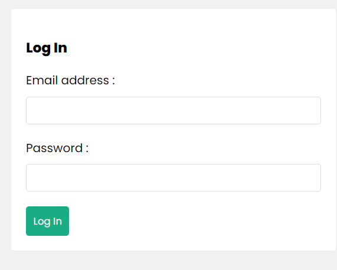

# MERNPlayground
Simple project learning MERN Stack

  
  

Welcome to my MERNPlayground project. In this project I am learning the basics of the MERN stack.
The Project does the basic CRUD operations powered by the Nodejs and Express backend.
For the frontend i have used Reactjs and MongoDb (Atlas) for the database.

The Project goes a further step to implement the JSON Web Token for authentication and Authorization.

The project contains two folders; the backend and the frontend.

For the Rest Api here is the postman published link :

https://documenter.getpostman.com/view/8103031/2s93Y5PL5F

There are a number of dependencies installed for this project to run smoothly.

### Demo Screenshots
Below are the screenshots how the final application looks like.

## Signup & Login Page
  

## Workout Form 
 

## Workouts Page
 

## database 
 
 

TECH STACK

  &nbsp;
  &nbsp;
  &nbsp;
  &nbsp;
  &nbsp;
  

## 🙋‍♂️ Support

💙 If you like this project, give it a ⭐ and share it with friends!

[☕ Buy me a coffee](https://ko-fi.com/devsawe)

